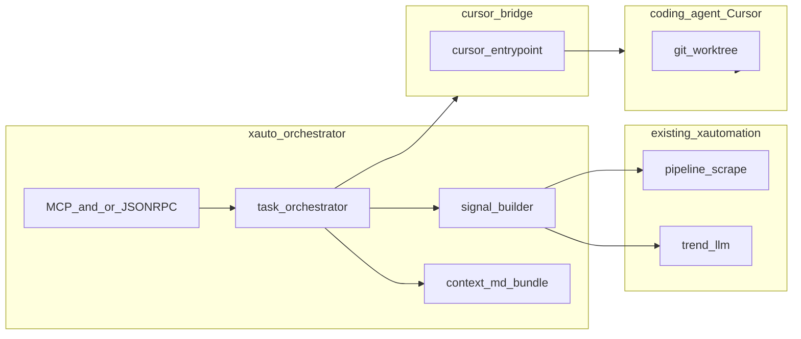

# Orchestration + A2A alignment + Cursor delegation

**Canonical location:** this file in the repo (`docs/orchestration-a2a-cursor-plan.md`).

An earlier Cursor **Plan** artifact may also exist under `~/.cursor/plans/` from the CreatePlan tool; treat **this doc as source of truth** for the project. Edit here and in git.

---
todos:
  - id: models-protocol
    content: "Pydantic models: OrchestratorTask, SignalBundle, ContextBundle (MD fleet paths + optional slurp caps), DelegateRequest/Result, structured errors per failure class"
    status: pending
  - id: context-md-fleet
    content: "Resolvers for coding-agent context files (configurable globs: AGENTS.md, .cursor/rules, etc.); feed into delegation payload, not into vendor system prompt"
    status: pending
  - id: worktree-policy
    content: "Worktree creation/management contract (path naming, base branch); cwd for CA = worktree root; document git requirements"
    status: pending
  - id: bridge-cursor-first
    content: "Cursor-first bridge (stable CLI entrypoint or MCP tool surface per Cursor docs); orchestrator only fixed argv; CA obeys its own tool/command policy from user config"
    status: pending
  - id: bridges-optional-gh
    content: "Optional GhBridge only if orchestrator needs non-CA GitHub reads; repo search remains CA responsibility by default"
    status: pending
  - id: orchestrator-merge
    content: "run_e2e_task: scrape/trend signal + context bundle + user-visible task prompt file in worktree; delegate to CA; merge DelegateResult into report"
    status: pending
  - id: a2a-cursor-consumer
    content: "Agent Card + minimal JSON-RPC or MCP alignment so Cursor (first external consumer) can call scrape/trend/delegate consistently"
    status: pending
  - id: docs-personal-use
    content: "User-facing doc chunk: personal/local use only, X ToS risk pointer, no warranty; keep short, factual"
    status: pending
  - id: errors-contract
    content: "Structured error taxonomy (auth, missing CLI, timeout, worktree failure, CA non-zero exit, oversize output) surfaced in API + logs"
    status: pending
  - id: observability-lightweight
    content: "Correlation task_id on every step; optional JSONL replay file of task events (append-only); no DB unless needed later"
    status: pending
  - id: tests-mocked
    content: "Pytest: mock subprocess/bridge, worktree path fixture, one orchestrator happy-path"
    status: pending
---

# A2A-style orchestration + coding-agent delegation (Cursor first)

## Context

- Product vision matches [`agent.md`](../agent.md): scrape X, match project signal, surface actionable insight **and** drive follow-on implementation.
- Code today: [`src/xautomation/pipeline.py`](../src/xautomation/pipeline.py) (scrape + rules + optional LLM rank), [`src/xautomation/matching/test_llm.py`](../src/xautomation/matching/test_llm.py) (timeline → trend JSON), FastAPI in [`pyproject.toml`](../pyproject.toml).
- [Agent2Agent (A2A)](https://a2a-protocol.org/dev/specification/) — JSON-RPC over HTTP(S), Agent Card at `/.well-known/agent.json`, task lifecycle. Complements **MCP** (agent ↔ tools). **First external consumer: Cursor** — plan assumes Cursor is integrated via MCP and/or documented CLI/agent hook **before** chasing other vendors.

## Terminology (what we meant — map to your model)

- **Bridge** — Small adapter *inside xautomation* with one job: take a normalized `DelegateRequest` and invoke **one stable external entrypoint** (e.g. Cursor CLI/agent/MCP client) with **fixed shape** (cwd, args, env). No general shell. Bridge does not “be” the coding agent; it **hands work** to it.
- **`DelegateRequest`** — In-process DTO (not a wire protocol by itself): **what to do** (which bridge), **worktree path**, **paths or contents of context MD fleet**, **X signal / trend payload** (or path to JSON file on disk), timeout. It is **not** required to map 1:1 to “system prompt” of the CA. Prefer **user-task message + files under worktree** so X text does not hijack vendor system instructions.
- **CLI instability (why it still bites you)** — If you only need “accept blob, run,” instability is **mostly** flags/exit codes/stderr shape (upgrade breaks script), **session/TUI** issues (PTY, paging), and **silent behavior change** (agent ignores file, uses wrong profile). Mitigation: pin versions, capture stderr into structured errors, integration smoke test when user upgrades Cursor.
- **Observability (plain English)** — After a long run, you can still answer **what happened, in order, with the same id** without re-scraping X. **Lightweight default:** every run gets a `task_id` (UUID); append **JSON Lines** (one event per line) under `.xautomation/tasks/<id>.jsonl` (or similar): started, scrape done, trend done, delegate sent, delegate finished, errors. **Replay** = reread that file. **Heavy later:** SQLite/Redis if you need multi-client concurrency — not required for personal daemon MVP.

## Product outcome (locked)

- Flow: **X-derived information → coding agent plans/implements in isolated worktree → user validates/tests.** Orchestrator supplies signal + agent-generated MD context; **repo exploration/search is CA’s job** (secondary from orchestrator POV: we do not implement ripgrep-based code search in the daemon unless you add it later for non-CA fallback).
- **Personal / local use only** — ship short factual disclaimer (ToS, no warranty); user responsible for compliance.

## Context strategy (locked)

- **Primary:** Reuse **MD fleet** coding agents already maintain (rules, `AGENTS.md`, project skills, etc.). Configurable glob list + max bytes per file + skip binary.
- **Secondary:** Any deep repo understanding or search is **delegated to the coding agent**, not the orchestrator’s core responsibility.

## Isolation + trust (locked)

- **Git worktree** for implementation: CA operates in `worktree_root`; orchestrator creates or requires pre-created worktree path before delegate.
- **Prompt injection:** do not pass raw X HTML/thread into CA system prompt. Prefer **structured JSON file(s) in worktree** + short instruction (“read `signal.json`, follow project rules under `context/`”).
- **Commands:** Orchestrator bridge uses **narrow, explicit** invocation. **Tool/command allowlists** that govern what the **CA** may run live in **Cursor/project CA config** — bridge does not try to replace Cursor’s safety model; it only starts the session/task with a known entrypoint.

## Target architecture (local daemon)

## Implementation phases (revised)

### Phase 1 — Contracts + context + errors

- Pydantic models: `SignalBundle`, `ContextBundle`, `DelegateRequest`, `DelegateResult`, **structured errors** (`BridgeInvocationError`, `WorktreeError`, `TimeoutError`, `AgentExitedError`, …).
- MD fleet resolver + caps; write **prompt artifacts** into worktree (`signal.json`, `context/` copies or symlinks per policy).

### Phase 2 — Cursor-first bridge + orchestration

- Implement **single** Cursor bridge behind `CodingAgentBridge` protocol; argv/env from config template **only**.
- `run_e2e_task`: scrape/trend → materialize worktree layout → build `DelegateRequest` → `DelegateResult` → user-facing summary JSON.
- Optional `gh` bridge **deferred** unless orchestrator needs GitHub without CA.

### Phase 3 — External agent interoperability (Cursor first)

- **MCP tools** (recommended for Cursor): `scrape_timeline`, `analyze_trends`, `delegate_implement` (names TBD) backed by same orchestrator.
- **Agent Card** + JSON-RPC subset aligned with A2A task shape for future non-Cursor clients; Cursor remains **first** integration target.

### Phase 4 — Hardening

- Mocked subprocess tests; stderr/exit parsing; version notes.
- Optional JSONL task log; redact secrets; personal-use doc chunk.

## Suggested package layout (when you implement)

- [`src/xautomation/orchestration/`](../src/xautomation/orchestration/) — tasks, orchestrator, context resolver, errors
- [`src/xautomation/orchestration/bridges/`](../src/xautomation/orchestration/bridges/) — `cursor` first; `gh` optional later
- Optional [`src/xautomation/a2a/`](../src/xautomation/a2a/) — Agent Card builder + JSON-RPC router
- Optional MCP server module co-located with FastAPI or separate entrypoint (decide at implementation)

## Risks (updated)

- Cursor surface (CLI vs MCP vs headless agent) shifts; **pin + smoke test**.
- Worktree + dirty main repo edge cases; document **clean tree / branch** expectations.
- X content in prompts: **file-based handoff** to CA reduces injection into system channel; still treat posts as untrusted data.
